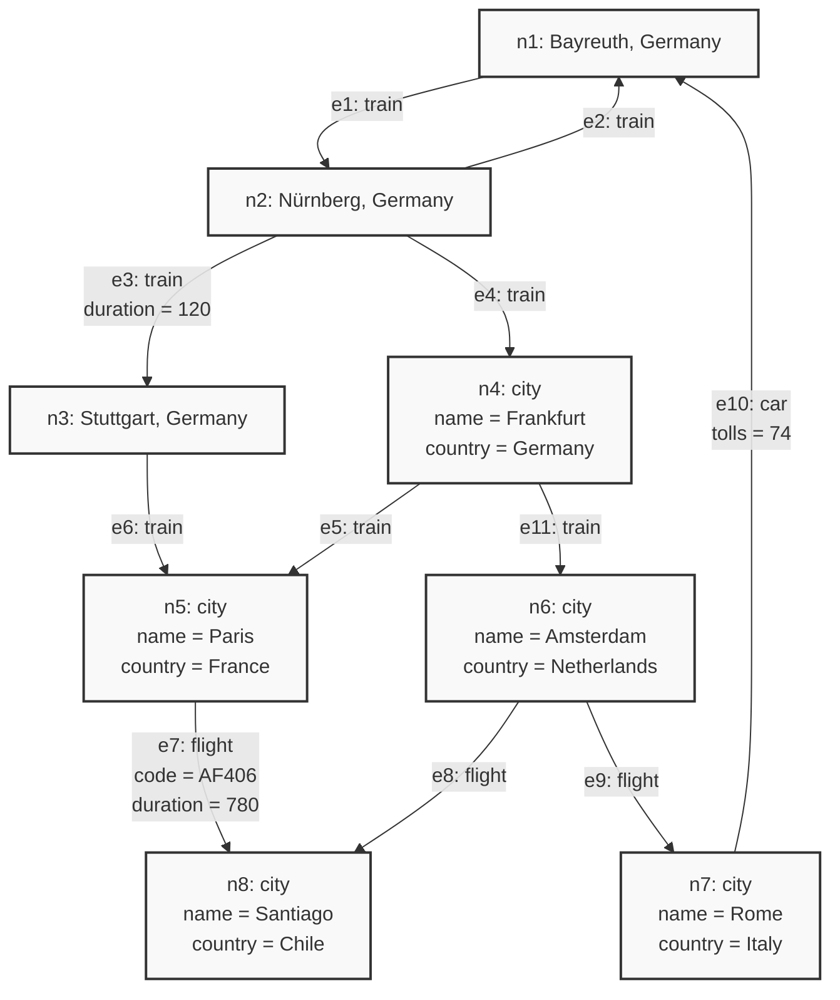

```mermaid
graph TB
    n1[n1: Bayreuth, Germany]
    n2[n2: Nürnberg, Germany]
    n3[n3: Stuttgart, Germany]
    n4[n4: city<br/>name = Frankfurt<br/>country = Germany]
    n5[n5: city<br/>name = Paris<br/>country = France]
    n6[n6: city<br/>name = Amsterdam<br/>country = Netherlands]
    n7[n7: city<br/>name = Rome<br/>country = Italy]
    n8[n8: city<br/>name = Santiago<br/>country = Chile]
    
    n1 -->|e1: train| n2
    n2 -->|e2: train| n1
    n2 -->|e3: train<br/>duration = 120| n3
    n2 -->|e4: train| n4
    n4 -->|e5: train| n5
    n3 -->|e6: train| n5
    n5 -->|e7: flight<br/>code = AF406<br/>duration = 780| n8
    n6 -->|e8: flight| n8
    n6 -->|e9: flight| n7
    n7 -->|e10: car<br/>tolls = 74| n1
    n4 -->|e11: train| n6


    classDef cityNode fill:#f9f9f9,stroke:#333,stroke-width:2px
    class n1,n2,n3,n4,n5,n6,n7,n8 cityNode
    
```