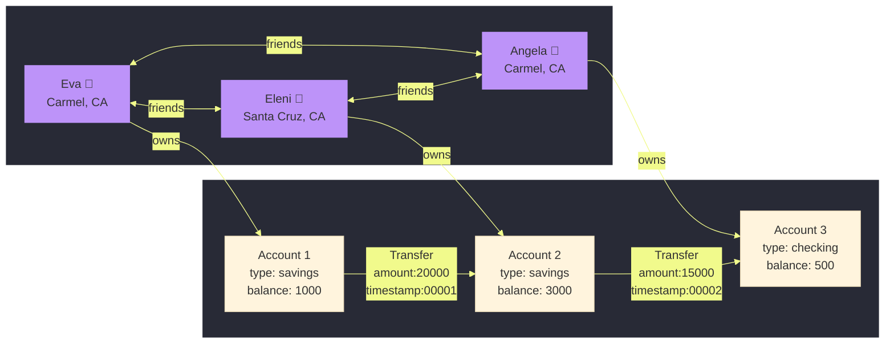

```mermaid
%%{init: {'theme':'base', 'themeVariables': {'lineColor':'#F1FA8C','secondaryColor':'#F1FA8C','background':'#282A36'}}}%%
graph LR
    subgraph row1[" "]
    eva[Eva 👩<br/>Carmel, CA]
    eleni[Eleni 👩<br/>Santa Cruz, CA]
    angela[Angela 👩<br/>Carmel, CA]
    end

    subgraph row2[" "]
    account_1[Account 1<br/>type: savings<br/>balance: 1000]
    account_2[Account 2<br/>type: savings<br/>balance: 3000]
    account_3[Account 3<br/>type: checking<br/>balance: 500]
    end

    eva -->|owns| account_1
    eleni -->|owns| account_2
    angela -->|owns| account_3

    eva <-->|friends| angela
    eva <-->|friends| eleni
    eleni <-->|friends| angela


    account_1 -->|Transfer<br/>amount:20000<br/>timestamp:00001|account_2
    account_2 -->|Transfer<br/>amount:15000<br/>timestamp:00002|account_3

    classDef nodes fill:#BD93F9,stroke-width:0px
    class eva,fatima,angela,uroosa,eleni,scott nodes
	

    classDef subgraphStyle fill:#282A36, stroke-width:0px
    class row1,row2,row3 subgraphStyle

```