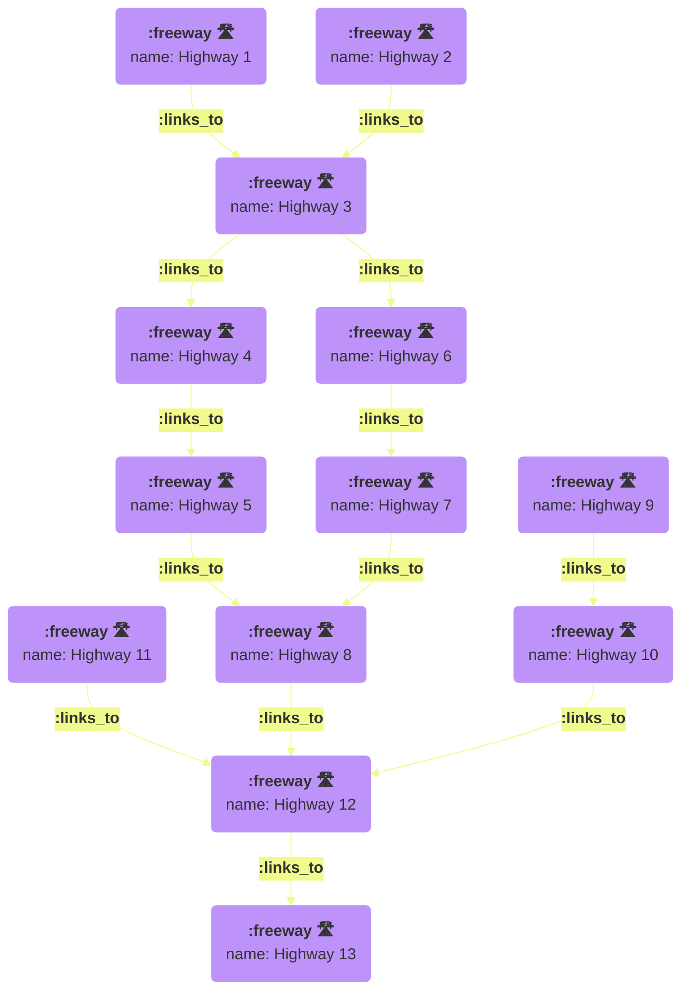

```mermaid

%%{init: {'theme':'base', 'themeVariables': {'lineColor':'#F1FA8C','secondaryColor':'#F1FA8C','background':'#282A36'}}}%%
graph TB
    highway1(<b>:freeway 🛣️</b><br/>name: Highway 1)
    highway2(<b>:freeway 🛣️</b><br/>name: Highway 2)
    highway3(<b>:freeway 🛣️</b><br/>name: Highway 3)
    highway4(<b>:freeway 🛣️</b><br/>name: Highway 4)
    highway5(<b>:freeway 🛣️</b><br/>name: Highway 5)
    highway6(<b>:freeway 🛣️</b><br/>name: Highway 6)
    highway7(<b>:freeway 🛣️</b><br/>name: Highway 7)
    highway8(<b>:freeway 🛣️</b><br/>name: Highway 8)
    highway9(<b>:freeway 🛣️</b><br/>name: Highway 9)
    highway10(<b>:freeway 🛣️</b><br/>name: Highway 10)
    highway11(<b>:freeway 🛣️</b><br/>name: Highway 11)
    highway12(<b>:freeway 🛣️</b><br/>name: Highway 12)
    highway13(<b>:freeway 🛣️</b><br/>name: Highway 13)


    highway1 -->|<b>:links_to</b>| highway3
    highway2 -->|<b>:links_to</b>| highway3
    highway3 -->|<b>:links_to</b>| highway4
    highway3 -->|<b>:links_to</b>| highway6
    highway4 -->|<b>:links_to</b>| highway5
    highway6 -->|<b>:links_to</b>| highway7
    highway5 -->|<b>:links_to</b>| highway8
    highway7 -->|<b>:links_to</b>| highway8
    highway9 -->|<b>:links_to</b>| highway10
    highway11 -->|<b>:links_to</b>| highway12
    highway8 -->|<b>:links_to</b>| highway12
    highway10 -->|<b>:links_to</b>| highway12
    highway12 -->|<b>:links_to</b>| highway13


    classDef nodes fill:#BD93F9,stroke-width:0px
    class highway1,highway2,highway3,highway4,highway5,highway6,highway7,highway8,highway9,highway10,highway11,highway12,highway13 nodes
	
```