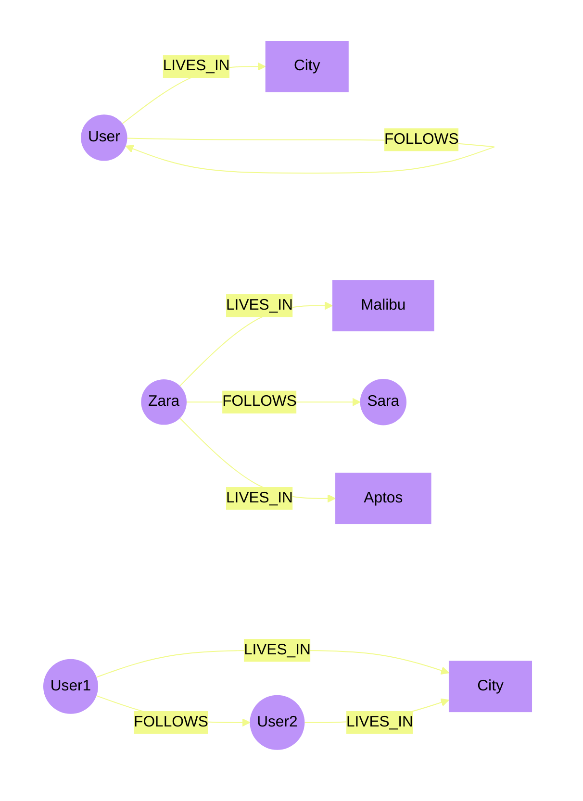

```mermaid
graph LR
%%{init: {'theme':'base', 'themeVariables': {'lineColor':'#F1FA8C','secondaryColor':'#F1FA8C','background':'#282A36'}}}%%

subgraph s3["Sample Query Graph (Same City Followers)"]
direction LR

User1@{ shape: "circle" }
User2@{ shape: "circle" }
City3["City"]

User1 -->|FOLLOWS| User2
User1 -->|LIVES_IN| City3
User2 -->|LIVES_IN| City3
end

subgraph s1["Property Graph"]
direction LR

Zara@{ shape: "circle" }
Sara@{ shape: "circle" }

C1["Malibu"]
C2["Aptos"]

%% LIVES_IN relationships
Zara -- "LIVES_IN" --> C1
%% FOLLOWS relationships
Zara -- "FOLLOWS" --> Sara
Zara@{ shape: "circle" } -- "LIVES_IN" --> C2


end

subgraph s2["Property Graph Schema"]
direction LR

User@{ shape: "circle" }
City["City"]

User@{ label: "User" } -->|"LIVES_IN"| City
User -- FOLLOWS --> User

end


classDef nodes fill:#BD93F9,stroke-width:0px, color:#000000
class User1,User2,User,U1,U2,Zara,Sara nodes


classDef cities fill:#BD93F9,stroke-width:0px
class City,C1,C2,City3 cities

classDef subgraphs fill:transparent,stroke-width:0px,color:#fff
class s1,s2,s3 subgraphs


```