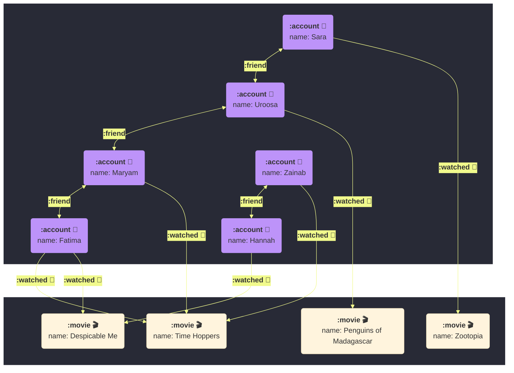

```mermaid

%%{init: {'theme':'base', 'themeVariables': {'lineColor':'#F1FA8C','secondaryColor':'#F1FA8C','background':'#282A36'}}}%%
graph TB

    subgraph row1[" "]
    Maryam(<b>:account 🧕</b><br/>name: Maryam)
    Sara(<b>:account 🧕</b><br/>name: Sara)
    Uroosa(<b>:account 🧕</b><br/>name: Uroosa)
    Fatima(<b>:account 🧕</b><br/>name: Fatima)
    Zainab(<b>:account 🧕</b><br/>name: Zainab)
    Hannah(<b>:account 🧕</b><br/>name: Hannah)
    end

    subgraph row2[" "]
    despicable_me(<b>:movie 🎬</b><br/>name: Despicable Me)
    penguins_of_madagascar(<b>:movie 🎬</b><br/>name: Penguins of Madagascar)
    time_hoppers(<b>:movie 🎬</b><br/>name: Time Hoppers)
    zootopia(<b>:movie 🎬</b><br/>name: Zootopia)
    end


    Sara <-->|<b>:friend</b>| Uroosa
    Uroosa <-->|<b>:friend</b>| Maryam
    Maryam <-->|<b>:friend</b>| Fatima
    Zainab <-->|<b>:friend</b>| Hannah
    Sara -->|<b>:watched 👀</b>| zootopia
    Uroosa -->|<b>:watched 👀</b>| penguins_of_madagascar
    Maryam -->|<b>:watched 👀</b>| time_hoppers
    Fatima -->|<b>:watched 👀</b>| time_hoppers
    Zainab -->|<b>:watched 👀</b>| time_hoppers
    Fatima -->|<b>:watched 👀</b>| despicable_me
    Hannah -->|<b>:watched 👀</b>| despicable_me


    classDef nodes fill:#BD93F9,stroke-width:0px
    class Maryam,Sara,Uroosa,Fatima,Hannah,Zainab,highway7,highway8,highway9,highway10,highway11,highway12,highway13 nodes
    
    classDef subgraphStyle fill:#282A36, stroke-width:0px
    class row1,row2,row3 subgraphStyle

```