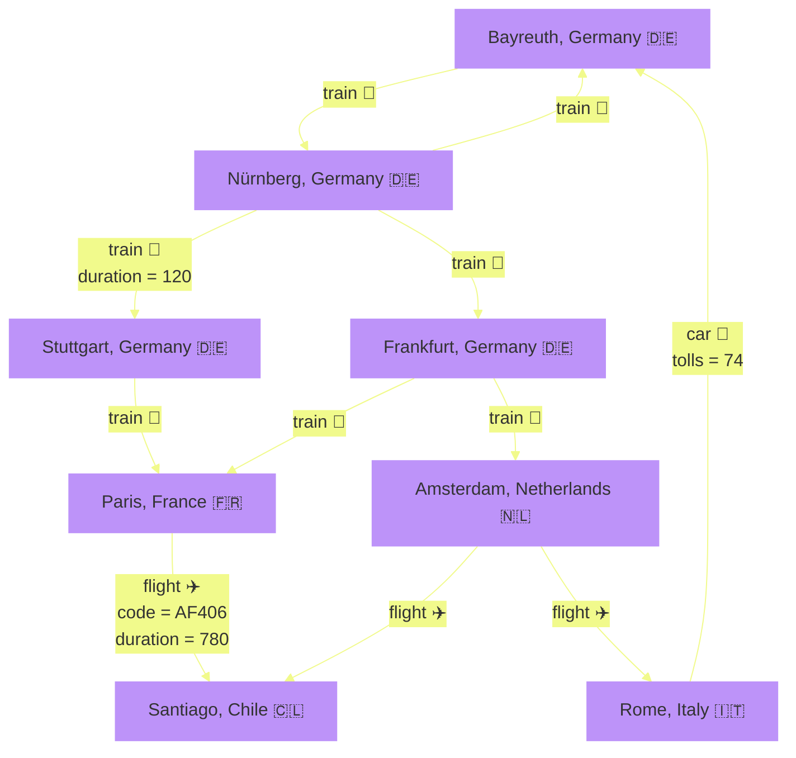

```mermaid
%%{init: {'theme':'base', 'themeVariables': {'lineColor':'#F1FA8C','secondaryColor':'#F1FA8C','background':'#282A36'}}}%%
graph TB
    n1[Bayreuth, Germany 🇩🇪]
    n2[Nürnberg, Germany 🇩🇪]
    n3[Stuttgart, Germany 🇩🇪]
    n4[Frankfurt, Germany 🇩🇪]
    n5[Paris, France 🇫🇷]
    n6[Amsterdam, Netherlands 🇳🇱]
    n7[Rome, Italy 🇮🇹]
    n8[Santiago, Chile 🇨🇱]
    n1 -->|train 🚂| n2
    n2 -->|train 🚂| n1
    n2 -->|train 🚂 <br/>duration = 120| n3
    n2 -->|train 🚂| n4
    n4 -->|train 🚂| n5
    n3 -->|train 🚂| n5
    n5 -->|flight ✈️<br/>code = AF406<br/>duration = 780| n8
    n6 -->|flight ✈️| n8
    n6 -->|flight ✈️| n7
    n7 -->|car 🚙<br/>tolls = 74| n1
    n4 -->|train 🚂| n6


    classDef cityNode fill:#BD93F9,stroke-width:0px
    class n1,n2,n3,n4,n5,n6,n7,n8 cityNode
    
```