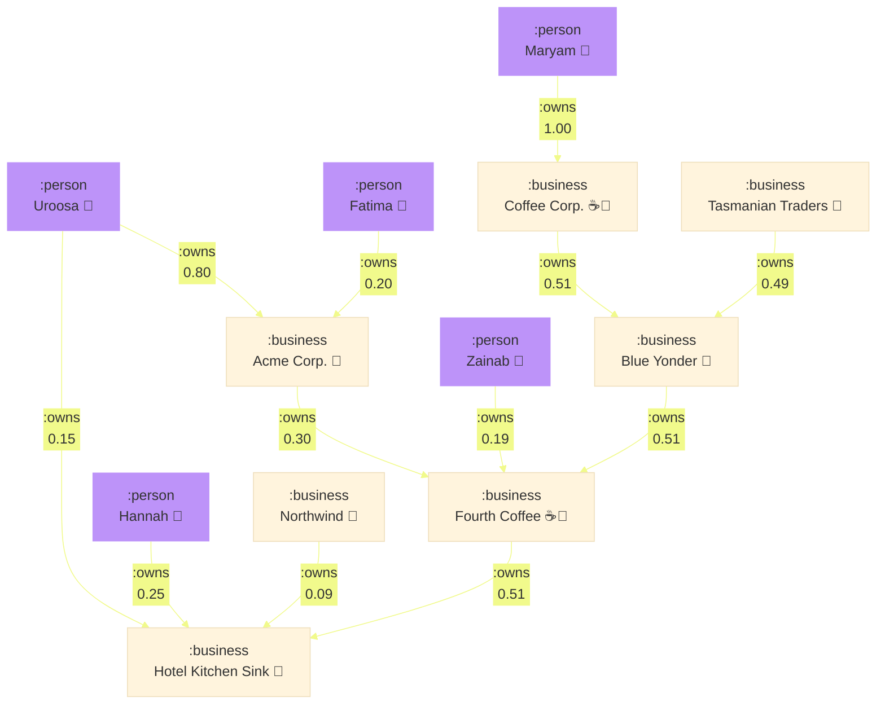

```mermaid
%%{init: {'theme':'base', 'themeVariables': {'lineColor':'#F1FA8C','secondaryColor':'#F1FA8C','background':'#282A36'}}}%%
graph TB
    fatima[:person <br/>Fatima 👩]
    uroosa[:person <br/>Uroosa 👩]
    zainab[:person <br/>Zainab 👩]
    hannah[:person <br/>Hannah 👩]
    maryam[:person <br/>Maryam 👩]

    acmecorp[:business <br/>Acme Corp. 🏢]
    northwind[:business <br/>Northwind 🏢]
    fourthcoffee[:business <br/>Fourth Coffee ☕🏢]
    tasmaniantraders[:business <br/>Tasmanian Traders 🏢]
    coffeecorp[:business <br/>Coffee Corp. ☕🏢]
    blueyonder[:business <br/>Blue Yonder 🏢]
    hotelkitchensink[:business <br/>Hotel Kitchen Sink 🏨]


    uroosa -->|:owns <br/>0.80| acmecorp
    fatima -->|:owns <br/>0.20| acmecorp
    uroosa -->|:owns <br/>0.15| hotelkitchensink
    hannah -->|:owns <br/>0.25| hotelkitchensink

    northwind -->|:owns <br/>0.09| hotelkitchensink
    acmecorp -->|:owns <br/>0.30| fourthcoffee
    fourthcoffee -->|:owns <br/>0.51| hotelkitchensink
    zainab -->|:owns <br/>0.19| fourthcoffee
    maryam -->|:owns <br/>1.00| coffeecorp
    coffeecorp -->|:owns <br/>0.51| blueyonder
    blueyonder -->|:owns <br/>0.51| fourthcoffee
    tasmaniantraders -->|:owns <br/>0.49| blueyonder

    
    classDef peoplenodes fill:#BD93F9,stroke-width:0px
    class eva,fatima,angela,uroosa,eleni,scott,zainab,hannah,maryam peoplenodes
    class northwind,acmecorp businessnodes
	

    classDef subgraphStyle fill:#282A36, stroke-width:0px
    class row1,row2,row3 subgraphStyle
```